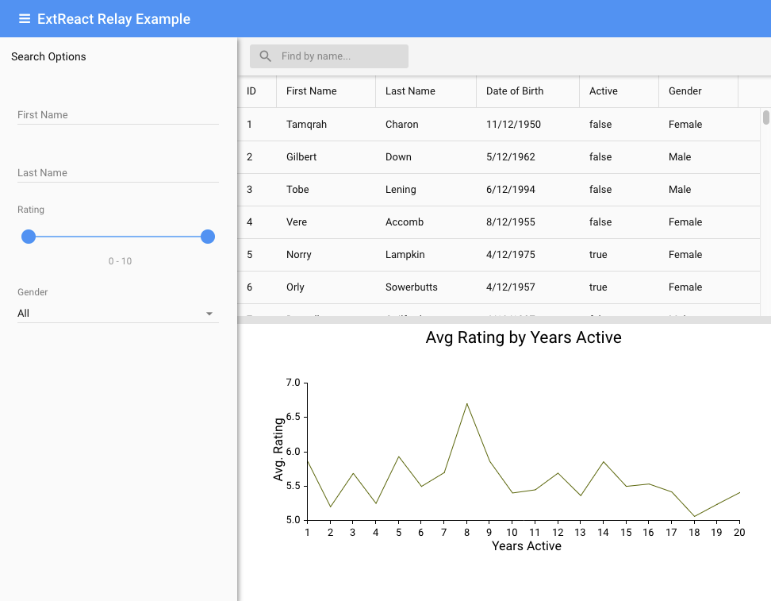

# GraphQL and ExtReact Tech Talk

This code was presented during Sencha's tech talk on August 31, 2017 entitled "Leveraging React and GraphQL to Create a Performant, Scalable Data Grid".



## How this Repo is Organized
This is a monorepo that uses [Lerna](https://github.com/lerna/lerna).  It contains three packages:

* server - A simple GraphQL server built with node, express, apollo, and sqllite.  It provides the back end for the two packages below
* apollo-example - An app that uses [react-apollo](https://github.com/apollographql/react-apollo) to fetch data for an ExtReact Grid.
* relay-example - Provides the same functionality as apollo-example, except using relay

Both the apollo-example and relay-example apps use Redux for state management.

## Running

In order to run the two example applications in this repo, you must have a trial or paid subscription to ExtReact. 
[Click here to sign up for a trial of ExtReact](https://www.sencha.com/products/extreact/evaluate/).  

Once you receive your credentials 
from Sencha, sign into Sencha's NPM registry by running the following command.  Existing ExtReact customers can skip this step.

```
npm login --registry=http://npm.sencha.com --scope=@extjs
```

Then, install the dependencies:

```
npm install
```

Finally, run the Apollo example:

```
npm run apollo
```

Or, run the relay example:

```
npm run relay
```
